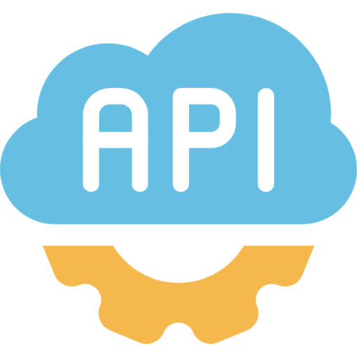
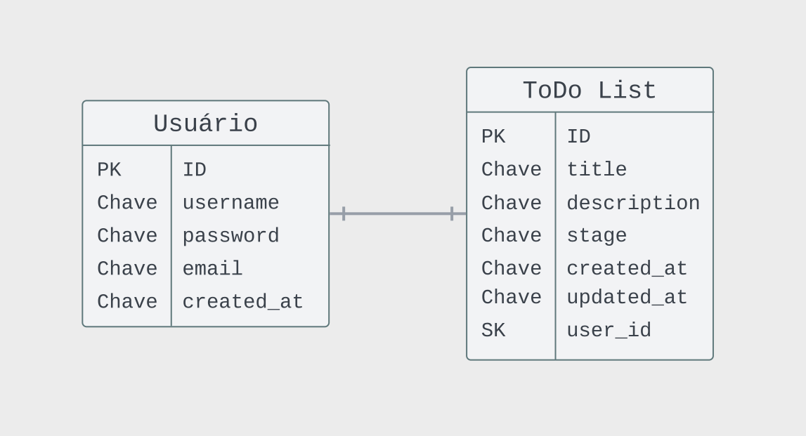
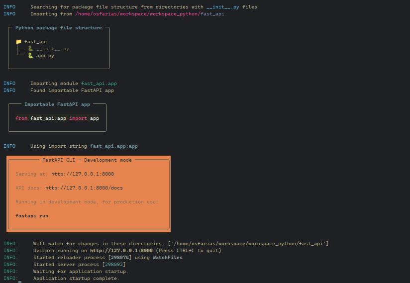
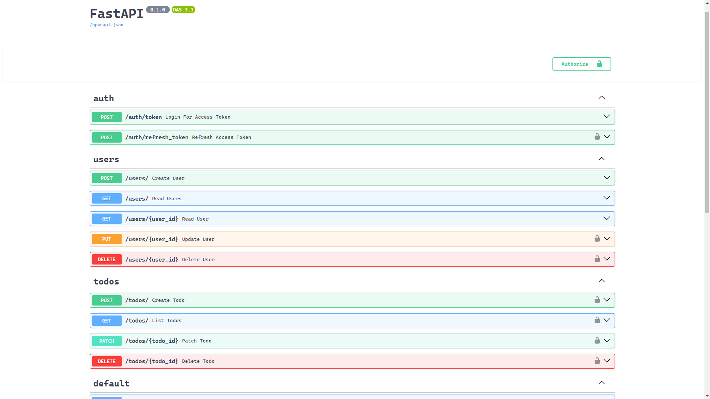
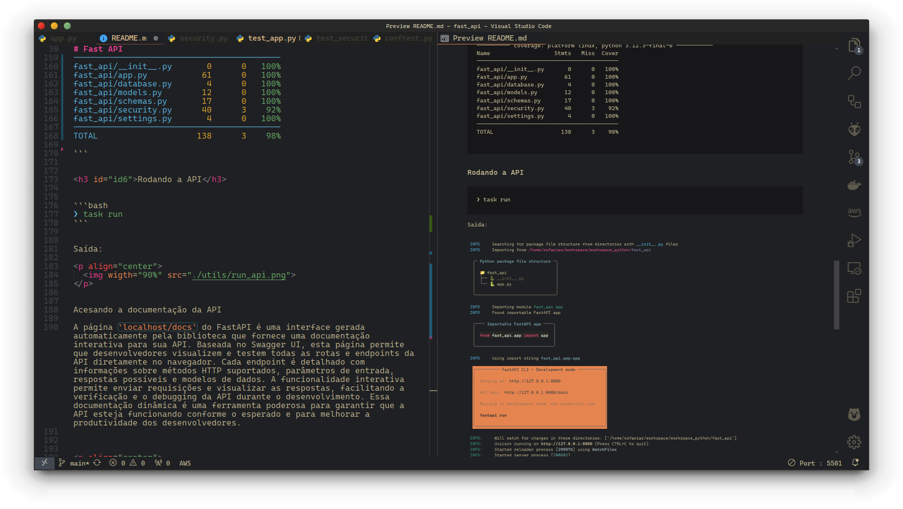
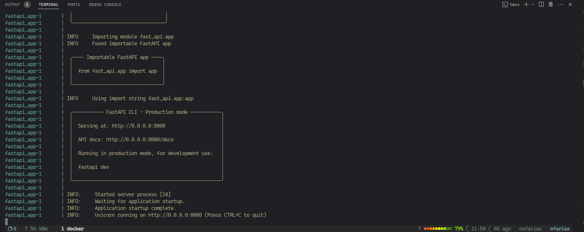

<p align=center> 
 
 
 
 


</p>

<p align="center">
  
</p>


<h3>Sumário</h3>


<p id="roadmap"> 
  <ul>
    <li> <a href="#id1">  Visão Geral</a> </li>
    <li> <a href="#id2"> Configuração do Ambiente</a> </li>
    <li> <a href="#id3"> Instalando as dependências do Projeto</a> </li>
    <li> <a href="#id4"> Rodando Códigos</a> </li>
  </ul>
</p>

# Fast API


<h3 id="id1">Visão Geral</h3>

Projeto completo de uma `Api Rest` com `FastAPI` desenvolvida no curso ministrado pelo canal [Live de Python](https://www.youtube.com/@Dunossauro).


A proposta consite em desenvolver um `CRUD` de cadastro de usuário com `autenticação` e `autorização` de `usuário` e outro `CRUD` para uma aplicação `ToDo List` que se relaciona com a base de dados do usuário, assim, cada usuário cadastrado poderá ter um `ToDo List` que só pode ser acessa pelo usuário que a criou.


<p align="center">
  
</p>

---


<h3>Requisitos do projeto</h3>


<ul>
    <li> <a href="#techs">Python 11+</a></li>
    <li> <a href="#id1">  Poetry ou pip</a> </li>
    <li> <a href="#id2"> FastAPI</a> </li>
  </ul>


<h2 id="id2">Configuração do Ambiente</h2>

Recomendo que use o [pyenv](https://github.com/pyenv/pyenv) para instalar a versão `3.12.3` do Python.

caso não tenha o `pyenv`  instalado em sua máquina, você pode instala-lo usando o [pipx](https://github.com/pypa/pipx), após instalar o `pipx` basta rodar o seguinte comando.

```bash
❯ pipx install pyenv
```

Agora com o `pyenv` instalado, basta roda o seguinte comando para instalar a versão `3.12.3` do Python.

```bash
❯ pyenv install 3.12.3
```

para definir a versão do python em seu projeto, você deve acessar pelo terminal o caminho do seu projeto e roda o comando abaixo em seu terminal.


```bash
❯ pyenv local 3.12.3 
```

pronto, agora você tem o `Python 3.12.3` definido para  seu projeto.


<h3 id="id3">Instalando as dependências do Projeto</h3>

Para instalar as dependências usando o `poetry` basta executar o seguinte comando em seu terminal dentro da pasta raiz do projeto:

```bash
❯ poetry install
```

Caso queira instalar usando o `pip`, use o comando abaixo:

```bash
❯ pip install -r requirements.txt
```

> [!WARNING]
> Certifique-se que seu ambiente esteja ativado.


---


<h2 id="id4">Rodando Códigos</h2>

Para executar os códigos, utilizaremos o `taskipy`, uma biblioteca em `Python` que facilita a criação de comandos para a execução de diversas ações.


<h3 id="id5">Formatação do Código</h3>

Antes de executar o código é importante formatá-lo usando os pradrão definidos pela pep8, para fazer isso de forma automática basta rodar o seguinte comando no terminal:


```bash
❯ task format
```


<h3 id="id5">Rodando os Testes</h3>

Para rodar os testes basta executar o seguinte comando com o ambiente virtual ativado:


```bash
❯ task test
```


Saída:

```bash
All checks passed!
============================= test session starts =============================
platform linux -- Python 3.12.3, pytest-8.2.2, pluggy-1.5.0 -- /home/osfarias/workspace/workspace_python/fast_api/.venv/bin/python
cachedir: .pytest_cache
rootdir: /home/osfarias/workspace/workspace_python/fast_api
configfile: pyproject.toml
plugins: anyio-4.4.0, cov-5.0.0
collected 19 items

tests/test_app.py::test_read_root_deve_retornar_ok_e_ola_mundo PASSED   [  5%]
tests/test_app.py::test_create_user_username_existing PASSED            [ 10%]
tests/test_app.py::test_create_user_email_existing PASSED               [ 15%]
tests/test_app.py::test_create_user PASSED                              [ 21%]
tests/test_app.py::test_read_users PASSED                               [ 26%]
tests/test_app.py::test_read_users_with_user PASSED                     [ 31%]
tests/test_app.py::test_read_user PASSED                                [ 36%]
tests/test_app.py::test_read_user_with_user PASSED                      [ 42%]
tests/test_app.py::test_update_user PASSED                              [ 47%]
tests/test_app.py::test_update_user_not_found PASSED                    [ 52%]
tests/test_app.py::test_delete_user PASSED                              [ 57%]
tests/test_app.py::test_delete_user_not_oermission PASSED               [ 63%]
tests/test_app.py::test_delete_user_not_found PASSED                    [ 68%]
tests/test_app.py::test_get_token PASSED                                [ 73%]
tests/test_app.py::test_get_token_incorret_email PASSED                 [ 78%]
tests/test_app.py::test_get_token_incorret_password PASSED              [ 84%]
tests/test_db.py::test_create_user PASSED                               [ 89%]
tests/test_security.py::test_jwt PASSED                                 [ 94%]
tests/test_security.py::test_jwt_invalid_token PASSED                   [100%]

---------- coverage: platform linux, python 3.12.3-final-0 -----------
Name                   Stmts   Miss  Cover
------------------------------------------
fast_api/__init__.py       0      0   100%
fast_api/app.py           61      0   100%
fast_api/database.py       4      0   100%
fast_api/models.py        12      0   100%
fast_api/schemas.py       17      0   100%
fast_api/security.py      40      3    92%
fast_api/settings.py       4      0   100%
------------------------------------------
TOTAL                    138      3    98%

```


<h3 id="id6">Rodando a API</h3>

 
```bash
❯ task run
```


Saída:

<p align="center">
  
</p>

<h3 id="id5">Acesando a documentação da API</h3>


A página `localhost:8000/docs` do FastAPI é uma interface gerada automaticamente pela biblioteca que fornece uma documentação interativa para sua API. Baseada no Swagger UI, esta página permite que desenvolvedores visualizem e testem todas as rotas e endpoints da API diretamente no navegador. Cada endpoint é detalhado com informações sobre métodos HTTP suportados, parâmetros de entrada, respostas possíveis e modelos de dados. A funcionalidade interativa permite enviar requisições e visualizar as respostas, facilitando a verificação e o debugging da API durante o desenvolvimento. Essa documentação dinâmica é uma ferramenta poderosa para garantir que a API esteja funcionando conforme o esperado e para melhorar a produtividade dos desenvolvedores.


<p align="center">
  
</p>


<h3 id="id5">Dados no Banco de Dados</h3>

A imgem abaixo é a visalização dos dados usando o `DBeaver`, foi usando o `SQLite` como banco de dados para perssistir os dados.


<p align="center">
  
</p>


---


<h2 id="id5">Dockenização da Aplicação</h2>

Uma das formas de disponibilizar um  projeto com todas as dependências configuradas e pronta para uso é a utilização do docker, para o projeto em questão, FOI usaDA uma imagem do `Python 3.12`  e realizado a  instalação das demais dependências como o `poetry` e `Bibliotecas python`, além disso, foi usado uma imagem do `postgreSQL` para realizar a pessistência dos dados. além das configurações necessárias para que a aplicação pudesse ter acesso ao container do banco de dados.

As configurações para a geração da imagem responsável por rodar a aplicação foram colocadas no arquivo `Dockerfile`, o arquivo `compose.yml` é responsável por estruturar os containers da aplicação `FastAPI` e do `PostgreSQL` além de realizar a configuração de comunicação entre a aplicação e o banco de dados.

Como requisito para rodar o projeto usando o docker, é necessário instalar o [Docker](https://www.docker.com) e o [Docker Compose](https://docs.docker.com/compose/install/).

com essas duas depêndencias instaladas, basta clonar esse repositório e acessar a pasta via terminal e executar o seguinte comando:


```bash
❯ docker compose up --build
```

Ao executar o comando, o docker irá baixar as imagens do `Python 3.12` e a do `PostgreSQL` além de realizar o `Build` da aplicação, caso tudo ocorra como o planejato você terá a aplicação rodando em sua máquina.


<p align="center">
  
</p>

basta acessar via navegador a aplicação pela url `localhost:8000/docs`. para sair da aplicação, basta usar usar o `Ctrl + C` do teclado.

---

<h3  id="id9">🎥 Rede Social</h3>

<p align=center> <a href="https://oseiasfarias.info"></a> <a href="https://www.linkedin.com/in/oseiasfarias/"></a>
<a href="https://oseiasfarias.medium.com"></a>
<a href="https://www.kaggle.com/osiasdfarias"></a>
</p>